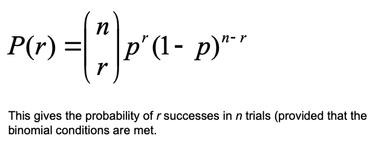
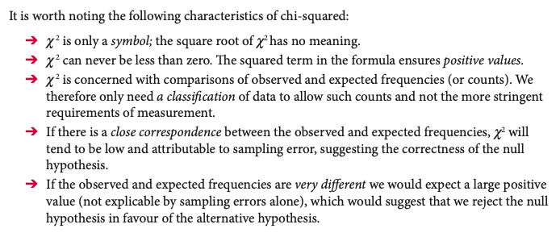
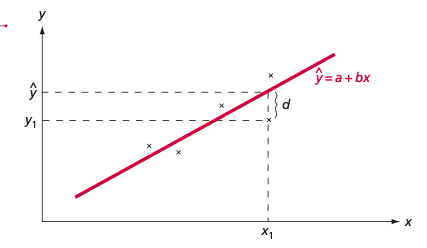
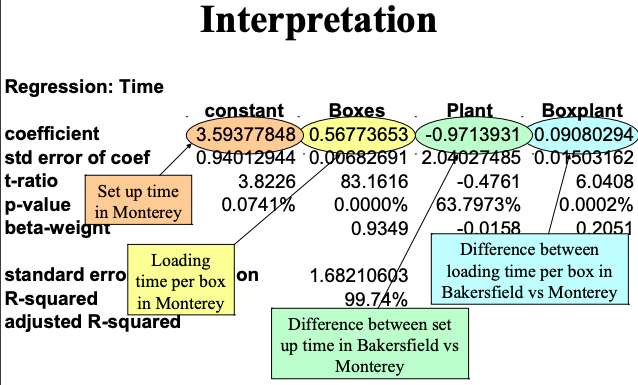
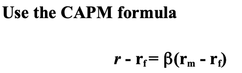
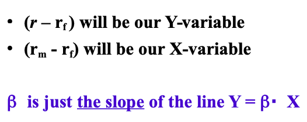

# Applied statistics - Summary & code
<br>   
<br>  
<br>
<br>
      
<p align="center">
  
</p>  

<br>   
<br>  
<p align="left"> 
<br>
*Prepared for exam and review by Daniëlle Kotter*

 

<div style="page-break-after: always;"></div>

#Table of content

[TOC]

<div style="page-break-after: always;"></div>

---

## Basics

**Statistics:** the science of learning from data  
**Individuals:** the objects described in a set of data -> cases 

**Population:** individuals / object we want to study  
**Variable:** any characteristic of an individual. There are 4 types of variables:

**- Qualitative:** Classifies data categorical  
		○ **Nominal:** Not ordered. F.E. gender  
		○ **Ordinal:** Ordered. F.E. Age group  
**- Quantitative:** Measures between data  
		○ **Interval:** No real 0. F.E. Temp in degrees  
		○ **Ratio:** Absolute 0. F.E. Salary  

**Primary data:** information that is not available and needs to be collected ourselves.  
**Secondary data:** information already available through research of others.

**Census:** full list of population. Very unlikely to be collected due to scale.  
**Sample:** subgroup from the wider population.

**Descriptive statistics:** identify characteristics of data sample group.  
**Inferential statistics:** infer data from subgroup to the entire population.

**Longitudinal:** aiming to forecast for a time frame.  
**Cross-sectional:** in a particular moment of time. 


###Basic commands:


**Basic packages:**

```
  "prob",
  "data.table",
  "distrEx",
  "LaplacesDemon",
  "formattable",
  "kableExtra",
  "knitr",
  "TeachingDemos",
  "dplyr",
  "dbplyr",
  "tidyverse",
  "Hmisc",
  "psych",
  "samplingbook",
  "swirl",
  "ggplot2",
  "swirl",
  "snpar",
  "BSDA",
  "actuar",
  "readxl",
  "stargazer"  
```

**Sample mean, standard deviation**

``` 
mean(variable)
sd(variable)
```
Removes values NA in a data set:

```
mean(variable, na.rm = TRUE)
sd(variable, na.rm = TRUE)
```

**Weighted mean & standard deviation**

Package: "HMISC".

```
weightedmean <- Xbar = wtd.mean(x,y)
weightedsd <- SQRT(Wtd.var(X,Y))/sqrt(n)
```

**Variance**

```
var(x)
```

**Tables frames & Matrixes**

```
matrix(c(1,2,3,4,5,6,7,8), nrow = 4, byrow = TRUE) <- organized by row
matrix(c(1,2,3,4,5,6,7,8), ncol = 4, byrow = FALSE) <- organized by col
data.frame(Column1 = c(1,2,3,4,5), Column2 = c(1,2,3,4,5))
data.table(Column1 = c(1,2,3,4,5), Column2 = c(1,2,3,4,5))

as.table(matrix(c(1,2,3,4,5,6,7,8), nrow = 4))
```

```
rbind(data, newvariable)
cbind(data, newvariable)

rownames(datatable) <- c()
colnames(datatable) <- c()
```

**Other:**

```
round(value, 2) <- two decimals
as.numeric(value)
rep(5,5) <- repeats 5, 5 times
percent(value) <- presents 0.25 as -> 25.00%
describe(variable)
fivenum(variable)
summary(variable)
str(variable) <- explains the variable
```

**Read excel**

```
library(readxl)
data <- read.xls("data.xlsx", stringsAsFactors = TRUE)
```

**Mathmatical values**

```
$\mu$ <- Population mean   
$\sigma$ <- Population sd   
$\bar{x}$ <- Sample mean   
${e}$ <- Standard error  
$\pi$ <- pie
$\ge$ <- Bigger than     
$\le$ <- Smaller than  
```

<div style="page-break-after: always;"></div>

##Topic 1 - Probability & Statistical inference

**Experiment:** trial, action that leads to one or several outcomes.  
**Sample space:** list of all possible mutually exclusive outcomes. Sum of prob: is 1.  
**Event:** one outcome or combined outcomes. F.E. Walking the dog / women walking the dog.  
**Expected outcome:** Probability of that particular outcome on a single trial * Total number of trials.  

**Axioms of probability**  
	- Prob always between 0 and 1  
	- Certain occurrence prob = 1  
	- Sample space = sum of prob = 1  
	- Prob of two mutual events = sum of their prob  
	- Prob of event not occurring -> compliment = 1 - its probability of it occurring  

**Basic relationships:**  
**1. Mutually exclusive event:** assign probabilities to outcomes that cannot occur at the same time.  
**2. Non-mutually exclusive event:** The probabilities of events can be summed. There is a possibility that events happen together.   
**3. Independent events:** prob event * prob event2. F.E. 2 heads in a row  
**4. Dependent events:** probabilities of the events are conditional. F.E. Pricking out a group of women/male. Once you choose a male, there is one male less to choose.  

**Subjective definition**  
Some subjects are able to assess the probability of an event before it occurs (Examples: local weather, production line knowledge, management outcomes). Survey methods to construct this subjective probabilities and then use it for the analysis. 

**Expected values:** If we know probabilities and values we can work out Expected Values (EV), sometimes referred to as Expected Monetary Values (EMV) by multiplying the value of the outcomes by probabilities.

<p align="center"> 

**Probability space**

Package = "prob".

```
out <- c(“Red”,“White”,“Black”,“Blue”,“Green”)
freq <- c(1,2,3,4,5)
s <- probspace(out,probs=freq)
```

*If you toss two fair coins, what is the probability of two heads?*

```
space <- tosscoin(2,makespace=TRUE)
p <- Prob(space, toss1=="H" & toss2=="H")
```

*When two dice are thrown, what is the probability of a 3 followed by a 5?*

```
space <- rolldie(2, makespace = TRUE)
p <- Prob(space, X1 == 3 & (X2 == 5) )
```

*Sampling from an urn with or without replacement. 3 balls and sample size of 2:*

```
urnsamples(1:3, size = 2, replace = TRUE, ordered = TRUE)
urnsamples(1:3, size = 2, replace = FALSE, ordered = TRUE)
urnsamples(1:3, size = 2, replace = FALSE, ordered = FALSE)
urnsamples(1:3, size = 2, replace = TRUE, ordered = FALSE)
```

### Bayes Theorem

**Posterior probabilities:** the probability an event will happen after all evidence or background information has been taken into account. F.E. Chance that an item is effective. 

**Prior probability:** the probability an event will happen before you taken any new evidence into account. This information influences your prediction of probability. F.E. 40% of product comes from machine A.

**Conditional probability:** the probability of one event occurring with some relationship to one or more other events. F.E. to calculate whether a defect item comes from machine A.
P(Machine A, Defective) / P(Defective).  

<p align="center"> 

**Unconditional probability:**

P(S) and P(NS)
Success or no success

```
prS <- c(0.4, 0.6)
```

**Conditional probability:**

P(P | S ) and P( P | NS)
Predicted given it is successful  
Predicted given it is not successful

```
prNS <- c(0.6, 0.2)
```

**Bayes prob**  
Posterior probabilities  
P(S | P) & P(NS | P)

```
BayesTheorem(prS, prNS)
```

###Statistical inference: 

**Inferential statistics:** derives properties and conclusions of a population based on the information of a sample. 

*Providing a*   
	- Statement expressed in probability  
	- Purpose of drawing conclusions from data  
	- Act as if the data comes from a random sample  
	- Must have the unrealistic assumption that standard deviation of the population is known  


**The goodness of result will depend upon:**  
- The size of the sample!  
- The variability of the sample!  
- Level of confidence!  

**Unbiased:** there is no systematic tendency to underestimate or over estimate the truth. The following statistics are unbiased:  
$\mu$ = Population mean  
$\sigma$ = Population standard deviation  
$\bar{x}$ = Sample mean  
s = Sample standard deviation  

**Confidence interval** = Confidence level that shows the probability of producing an interval that contains the unknown parameter. Interval of numbers between mean +/- margin of error.

**Margin of error:** Reflects how accurate we believe the estimate is based on variability & confidence. It is a procedure to catch the true population mean.  
Margin of error = z * sd / sqrt(n)

**What to do when the margin of error is too large:**  
	- Use lower level of confidence  
	- Increase sample size  
	- Reduce standard deviation. F.E. Controlling measurement process or changing population sample  


### Sample: 

Subgroups of a population used to draw inferences about characteristics of population. Sample must be representative of the population. We know that the value of the sample mean will vary from sample to sample – follow a sampling distribution: We would expect the sample means to vary around the true
(population) mean. The variation will depend on sample size, the larger the
sample the less spread the (sampling) distribution

**Parameter** = characteristic that describes the population    
**Statistics** = characteristic that describes a sample. Used to estimate the unknown parameter.   

**Aspects to take into account while sampling:**  
	1. Definition of the objective population  
	2. Determine base for sampling  
	3. Determine sampling method  
	4. Choose margin of error / sample size  
	5. Sampling execution  

**Non probabilistic sampling:** convenience, voluntary responses  
**Probabilistic sampling:** random & satisfied. All individuals have the same probability in being included in the sampling.

**Non probabilistic methods:**  
	**1. Convenience sampling:** asking whoever is easily available. Convenient & cheap. Risk of biased.  
	**2. Voluntary response sampling:** answer if you want. Response already biased and who you reach also biased.  
	**3. Quota sampling:** choose sample based on characteristics that represent the population. F.E. 50% men/female  

**Probabilistic methods:**  
	**1. Simple random sample:** actually random (pulling number or randomizers). Required full list of the population.  
	**2. Stratified random sample:** identify relevant characteristics. Randomly sampled from each proportion characteristics.  
	**3. Joint stratified random sample:** size depends on relative weight due to several characteristics. Demanding and large scale techniques.  
	**4. Non-proportional stratified sampling:** over representing minorities to capture true heterogeneity of opinions.  


###How to choose a sample size:

**Statistically:**  
	- Variability in the variable within the population  
	- How confident do we want to be in a precise estimate  

**Economically**  
	- Cost of obtaining the sample  
	- Worth cost/benefit in decision making   

**Desirables for estimators:**  
	- Unbiased: expected value of the statistical equals parameters  
	- Consistency: bias decrease when sample size increases  
	- Efficiency: unbiased estimator with the smallest variance is the most efficiet estimator.  

<div style="page-break-after: always;"></div>

##Topic 2 - Discrete probability


###Uniform discrete probability distribution

This distribution describes situations where all outcomes are equally likely; it is the assumption you make about a “fair coin”, or a pack of cards.

If we generalize this situation we might define a discrete uniform distribution as one where there are a given number of possible outcomes, and each has the same probability. Putting this another way, if there are n outcomes, then the probability of any particular outcome will be 1/n. 

Throwing two dies and adding up the amounts is not uniform distribution. There are multiple ways of getting a 7 for example. 


1. Sample space with a set probability. Size = amount of tries
2. Density function: Individual probability. F.E. Getting a 4
3. Cumulatative density: Uniform for a certain value distribution. F.E. 4 or less. 4 or more? 1-punif 3
4. Inverse cumulative density: Uniform for a certain probability ( up until a certain value). F.E. up to 25% of the tries

```
1. sample(p, size=n, replace=TRUE)
2. dunif(X, min = a, max = b)
3. punif(X, min=0, max=6)
4. qunif(X, min=0, max=6)
```
***Default = # or less. For # or more do: 1-probability of # or less*** 

###Binomial distribution

Binominal distribution =  yes or no answer. Only two outcomes F.E goal/miss, student/no student. Each outcomes is independent. Requires set probability. Assumptions when using the binomial distribution:  
• there are 2 outcomes to each trial (e.g. yes or no)  
• the probability of a yes (or a success) does not change from trial to trial (each trial is independent)  

If we generalize this situation we might define a binomial distribution as one where there are only two defined outcomes of any particular trial and the probability of each outcome remains constant from trial to trial (i.e. the events are independent). However, there are multiple ways to get the combination of events. Therefore we use:

**Combinations**  
N = number of trials  
R = number of successes  
<p align="left"> 

**Factorials:**    
0! = 1  
1! = 1  
2! = 2 * 1 = 	3   
3! = 3 * 2 * 1 = 6  
4! = 4 * 3 * 2 * 1 = 24  
etc.

<p align="left"> 

**Code**

1. Binomial for a specific value for a certain sample. F.E. 2 from the sample are successful.
2. Binomial for a certain distribution of the sample. F.E. At most 2 in the sample are successful. Or 5 or more. 
3. Binomial for a certain percentage of the  sample. F.E. 25% of the sample has x value or less. 
4. Difference between two binomial values. F.E. Prob there are between 4 and 5 of the trials successful.

```
1. dbinom(x, size = n, prob = y)	
2. pbinom(x, size = n, prob =y)	
3. qbinom(p, size = n, prob =y)	
4. diff(pbinom(c(X,Y), size = n, prob =y)	
```
***Default = # or less (left area of the distribution). For # or more do: 1-probability of # or less*** 

###Poisson distribution

Poisson distribution = defined by the average. Poisson works particularly well when =   
	- You can only count the characteristics but not without.   
	- There are a large number of trials but low number of probability.  

<p align="left"> 

x = number of occurrences  
L = average number of times a characteristics occurs  
e = constant   

**Expected value =** n * p = LAMDA

1. Poisson for a certain value. Lambda = n*p. F.E. Prob of having a 5
2. Poisson for a certain value distribution. F.E. Prob of having less than 5. More than 5? = 1-	Ppois(4, lambda)
3. Poisson for a certain probability to capture a certain value. F.E. Poisson value for 25%.

```
1. dpois(x,lambda)	
2. ppois(x, lambda)	
3. qpois(x,lambda)
```

***Default = # or less (left area of the distribution). For # or more do: 1-probability of # or less*** 

### Examples different distributions:

**(i) The number of goals scored during a football match?**  
Poisson distribution

**(ii) The numbers drawn in the UK lottery?**  
Uniform distribution

**(iii) The number of faulty items coming off a production line?**  
Binomial distribution

**(iv) The number of females attending a cinema for a particular film?**  
Poisson or binomial distribution

**(v) The number of people arriving at a queue?**  
Poisson distribution

<div style="page-break-after: always;"></div>

## Topic 3 - The normal distribution

**Normal distribution:** a distribution that is symmetrical around its mean; To generalize, when a variable is continuous, and its value is affected by a large number of chance factors, none of which predominates.   

**Characteristics of a normal distribution:**  
	- Continuous (curve)  
	- Bell shaped - symmetrical  
	- Basis for statistical theory  
	- Distribution of the curve = 1  
	- Uni-model = single peak  
	- Described by mean and standard deviation  
	- Wider bell curve --> larger normal distribution  

$\mu$ = Mean   
$\sigma$ = Standard deviation

<p align="left"> 

**Empirical rule**

For all normal distributions: 68-95-99.7 rule

99.7% of observations are located between: -3 mu and 3  
95% of observations are located between: -2 mu 2  
68% of observations are located between: -1 mu 1

**Normal distribution**

**Z-value**

A standardized observation. Probabilities have been tabulated for the standard normal distribution. The z-value being the number of standard deviations away from the mean.

```
z <- (x-mean)/sd
```

1. Normal distribution for a certain proportion. Pi = population proportion mean%.
2. Normal distribution for a certain value distribution. F.E. Prob of value above 5. FALSE
	Prob less than 9. TRUE
3. Normal distribution for a certain probability to capture a certain value. F.E. Value that is given at 25% point. 
4. Difference between two values on the normal distribution. F.E. between 5 and 10. 

```
1. pnorm(X, pi, sd, lower.tail = FALSE)
2. pnorm(X, mean = mean, sd = sd, lower.tail = FALSE)
3. qnorm(p, mean = mean, sd = sd, lower.tail = FALSE) 
4. diff(pnorm(c(X,Y), mean = mean, sd = sd, lower.tail = FALSE)
```

lower.tail = TRUE: The area of the left side of the slope  
lower.tail = FALSE: The area of the right side of the slope

**Confidence interval for normal distribution**

```
z.test(x, sd=sigma)
binconf(x = x, n = n) <- proportions
t.test(variable) <- t-distribution for conf.inv
```

### Plotting the normal distribution

"With mean = 3 and standard deviation = 7  
Limits: mean +/- 3 * standard deviation  = 3*7 = 21 
Lower limit = 3 – 21 = -18  
Upper limit = 3 + 21 = 24"  

Example:

```
x <- seq(15, 45, length=50)
y <- dnorm(x, 30, 5)
plot(x,y,type="l",lwd=2,col="black")

x <- seq(15,35,length=100)
y <- dnorm(x, 30,5 )
polygon(c(15,x,35),c(0,y,0), density = c(15, 35), col = "black")

p <- pnorm(35, mean = 30, sd = 5,lower.tail = TRUE)
text(0,0.15,"68%")
```

### Binomial

It will be possible to use the Normal distribution as an approximation to the Binomial if: 
n is large and p > 0.1 

the mean = n*p  
standard deviation = √[np(1 − p)]   
X = given x +/- 0.5

<p align="left"> 

**Binomial for a sample**

1. Density function (individual probability). 
2. Cumulative density (between certain values). 
3. Difference between two binomial values
4. Inverse cumulative density. For a certain prob. 

```
1. dbinom(x, mean, sd, lower.tail = FALSE)
2. pbinom(x, mean, sd, lower.tail = FALSE)
3. diff(pbinom(c(X,Y), mean = mean, sd = sd, lower.tail = FALSE)
4. qbinom(p, mean, sd, lower.tail = FALSE)
```

###Poisson

Lambda = np = mean  
X = general x +/- 0.5

<p align="left"> 

This normal approximation can be used if lambda is > 30


<div style="page-break-after: always;"></div>

##Topic 4 - Samples, estimation & confidence intervals

 
**The standard error of the sampling distribution of the mean**

The sampling distribution of the sample mean will approximate to a normal distribution. The mean of the distribution is $\mu$, the standard error ${e}$ = $\sigma /\sqrt{n}$. That is the measure of spread for a sampling distribution, the standard deviation of the sampling distribution.

The point estimates gives us a particular value as an estimate of the population parameter. Usually for a normal distribution, the $\bar{x}$ and the $\mu$ are unbiased, meaning that when n tends to infinity, $\bar{x}$ tends to $\mu$ and s tends to $\sigma$.

The confidence intervals gives us a range of values which is likely to contain the population parameter.

```
se <- sigma / sqrt(n)
```

**Probability sample**

1. To find the probability that X is larger than mu
2. To find the probability that X is smaller than mu

```
p <- pnorm(X, mu, se, lower.tail = TRUE) 
p <- pnorm(X, mu, se, lower.tail = FALSE)
```

**Probability proportions sample**

```
sd <- sqrt((pi*(n-pi))/n)
z <- (p - pi)/sd

pnorm(X, pi, se, lower.tail =FALSE)
```

**Sample size**

Package = "samplingbook".

Provides the sample size needed to have a 95% confidence to estimate the population mean. 
Level = confidence level. Se is required standard error. 

```
sample.size.mean(se, sigma, level=0.95)
```

<div style="page-break-after: always;"></div>

## Topic 5 - Significance testing

**Significance testing** aims to make statements about a population parameter or parameters on the basis of sample evidence called point estimates. Does the sample result support or are consistent with some fact or supposition about the population. If we want to infer a unknown population value, significance testing estimates a plausible interval for the population value. 

**Parametric tests:** Rely on assumptions about the shape of the underlying population distribution (normal distribution) and the parameters (means & standard deviation) of the assumed distribution.

**Non-parametric tests:** Rely on none or few assumptions about the form or parameters of the population distribution from which the sample was drawn. Includeds non-numeric values. 

### Hypothesis testing  

**Hypothesis testing:** setting up an idea, concept or proposition we accept or reject. In term of structure we set up two hypothesis: Null hypothesis and Alternative hypothesis.  

**Null hypothesis** = H0 = A statement of a no change or no difference from the idea or proposition we are testing. H0 is assumed to be true while we do the test. F.E. Innocent until proven guilty.   
	- H0 = $\mu$ = $\mu$0 (mean).   
	- H0 = $\pi$ = $\pi$0 for a %  

**The alternative hypothesis** = HA = What we accept if on the basis of evidence (generally collected data) we can reject H0. Generally not specific. F.E. More than $\mu$  
	- H1 = $\mu$ = different than u0  
	- H1 = $\pi$ = different than $\pi$0  

<p align="left"> 

###The difference between confidence interval and a test of significance

Significance testing and confidence interval are related to each other. The confidence interval is explained as a set of acceptable hypotheses. The null hypothesis lies within the confidence interval when it is accepted whereas significance testing means using the sample data to find out if hypothesis are accepted or not. 

Both, confidence intervals and significance testing, use sample data and rely on sampling distributions. They also affect each other as for example the sampling error becomes larger when the interval becomes wider by having a higher level of confidence, which means being more certain of a result. 


**Confidence interval** =  a set acceptable hypothesis. If we reject H0 we say we are confident that our results are not due to chance or sampling error.

**Test statistic =**  Compares the sample evidence with the null hypothesis (value assumed true) approximated by the normal distributions. The closer to 0, the more likely H0 is correct.

1. Values
2. Proportions

z = X - $\mu$ / se  
z = p - $\pi$ / sqrt($\pi$(100-$\pi$) / n )

P = Sample percentage  
Pie ($\pi$) = the claimed population percentage


**Finding confidence intervals:**

```
mu <- mu
sd <- sd
se <- sd / (sqrt(n))
n <- n
conf_int95 <- cv * sd / (sqrt(n))
mu_plus <- mu + conf_int95
mu_min <- mu - conf_int95

ts <- (X-U) / se
```

### Critical values

Critical value = Defines the points at which the chance of the H0 being true is at a small, predetermined level. Significance level. Usually 5% --> 95% confidence level --> 1.96. If the test statistic is between -1.96 & +1.96, we fail to reject H0. If it is more, it is an extreme value and we would reject H0 as it lies within the rejection area. 

Two-sided test:

- H0 = $\mu$ = $\mu$0 (mean). 
- HA = $\mu$ = different then $\mu$

Proportions:  

- H0 = $\pi$ = $\pi$0 for a %  
- HA = $\pi$ = different then $\pi$0


**Critical value, sample > 30**

1. Two-sided: Critical value, 5% significance level = 1.96
2. Two-sided: Critical value, 1% significance level = 2.58
3. Two-sided: Critical value, 10% significance level = 1.96
4. One-sided: Critical value, 5% significance level = 1.64
5. One-sided: Critical value, 1% significance level = 2.33
6. One-sided: Critical value, 10% significance level = 1.28

```
cv <- qnorm(0.975)
cv <- qnorm(0.995)
cv <- qnorm(0.95)

cv <- qnorm(0.95)
cv <- qnorm(0.99)
cv <- qnorm(0.90)
```

**Critical values t-distribution**

1. One-sided: critical value at a 5% significance level
2. One-sided: critical value at a 10% significance level
3. One-sided: critical value at a 1% significance level
4. Two-sided: critical value at a 5% significance level
5. Two-sided: critical value at a 10% significance level
6. Two-sided: critical value at a 1% significance level

```
cv <- qt(0.95, df) 
cv <- qt(0.90, df) 
cv <- qt(0.99, df)
cv <- qt(0.975, df)
cv <- qt(0.95, df) 
cv <- qt(0.995, df)
```

df = degree of freedom


**One-sided test**

We want to specify whether the real value is above or below the claimed value in those cases where we are able to reject the null hypothesis. Therefore, we want to concentrate the chance of rejecting H0 at one end of the normal distribution. The significance is 5%, the critical value -1.645 or +1.645. All 5% on one side. 

###Type of errors:

There will always be some chance that the true population value really does lie outside of the confidence interval or that we will come to wrong decisions. For a 95% confidence level, there is a 5% chance you are wrong. 

**Power of the test:** being able to reject the hypothesis if it is not correct

Type 1 error: H0 is correct, but it is rejected  
Type 2 error: H0 is not correct, but it is accepted  

  
### Sample significance testing

Package: "BSDA".

1. Two-sided
2. One-sided: X is greater than the population mean
3. One-sided: X is less than the population mean

```
1. tsum.test(mean.x = X, s.x = sd, n.x = n, mu = mu, alternative = "two.sided", var.equal = TRUE) 

2. tsum.test(mean.x = X, s.x = sd, n.x = n, mu = mu, alternative = "greater", var.equal = TRUE) 

3. tsum.test(mean.x = X, s.x = sd, n.x = n, mu = mu, alternative = "less", var.equal = TRUE) 
```

**For proportions:**

```
prop.test(x= x,n = n,p = p,correct=TRUE,alternative="two.sided")
```
Same goes for above: two.sided, greater, less  
  
###Test of equality

H0 <- $\mu1 = \mu2$ or $(\mu1 - \mu2) = 0$  
HA <- $\mu1 \neq \mu2$ or $\mu1 - \mu2 \neq 0$

Difference in two means with a certain confidence level confidence interval. Default = 95%

```
tsum.test(mean.x = X, s.x = sd, n.x = n, mean.y = X, s.y = sd, n.y = n, var.equal=FALSE)
```

2-sample test for equality of proportions without continuity correction.

```
data <- matrix(c(values), byrow=TRUE, nrow=2)  
prop.test(data, correct=FALSE, alternative="greater")
```

The usual value of the null hypothesis of the population parameter that we have as a difference with the sample estimation in the numerator of the test statistic in this case is equal to 0, since we postulating in the null hypothesis that the population percentages are equal so the difference is 0.


###P-value

P value = measure of risk that you reject the null hypothesis when you should not have. If you reject the null hypothesis, you have ..% chance that you made a mistake.

If p-value is < then the significance value (5%), reject null hypothesis. 
P-value > than the significance value, we cannot reject the null hypothesis. F.E. 1.96 critical value = significance value of 0.05. If you get a p-value of less than 0.05, we can reject the null hypothesis. 

**Reservations about test conclusions**

- How was the efficiency measured?
- How were the sample participants selected?
- Were the conditions of the sample the same in each sample?
- Did observing the sample affect performance?

##Topic 5 - Non-Parametric testing

Looks at the overall distribution and compares this to some known or expected value. When do we use this? F.E. You only have nominalor ordinal data. Used when:  
	- A null hypothesis cannot be stated in terms of parameters  
	- A level of measurement has been achieved that gives validity to differences.  
	- The test statistics follows a known distribution

It is a statistical method that makes no assumption on the population distribution or sample size. In general, conclusions drawn from non-parametric methods are not as powerful as the parametric ones. However, as non-parametric methods make fewer assumptions, they are more flexible, more robust, and applicable to non-quantitative data.

**Contingency table / frequencies**

```
table(variable)
prob.table(variable
```

###Chi-square

Chi-square test looks at whether there is a statistical association between the two sets of answers. May allow the development of a proposition that there is a causal link between the two. Steps:

1. State the hypothesis:   
	H0 there is no association between the two sets of answers  
	HA there is an association between the two sets of answers
2. Choose statistical distribution. For cross-tabulations --> chi-square distribution
3. State the significance level. Mostly 5%.
4. State critical value. 
5. Calculate test statistic
6. Compare calculated value (test statistic) and the critical value 

Degree of freedom = # of row - 1 * # of columns = fixed

O = Observed cell frequencies (the actual answers)  
E = Expected cell frequencies (if the null hypothesis is true)

Expected value = probability of an independent event  
Expected cell frequency =  (row total) * (column total) / Grand total

<p align="left"> 

The statistic calculated involves squaring values, and thus the result can only be positive. Shape is determined by the number of degrees of freedom.   
	- Whether a relationship exists within a cross tabulation  
	- The goodness of fit for a known distribution to a set of data

Relatively low df --> positive skewed distribution   
Relatively high df --> The shape of the distribution approaches normal distribution

1. Chi-square test
2. Get the expected values
3. Probability for chi-square 

```
data <- matrix(c(27,373,33,567),byrow=TRUE,nrow=2)
chisq.test(data,correct=FALSE)

chisq.test(data,correct=FALSE)$expected

prop.table(chisq.test(data,correct=FALSE)$expected,1)
prop.table(chisq.test(data,correct=FALSE)$expected,2)
```

**All expected frequencies must be above five! If not, categories must be combined!**

**Conclusion:**

Chi-squared cannot be zero. If all expected cell frequencies were equal to the observed cell frequencies, then the value of chi-squared would be 0.

Any difference in observed - expected cell frequencies is either due to:  
	- Sampling error  
	- Association between answers  

1. Difference more likely it is that there is an association  
2. If calculated value > than the critical value, we will fail to reject the H0. 


*"There appears to be an association between … and …. We need to examine how that association manifests itself, whether such an association is meaningful within the problem context and the extend to which the association can be explained by other factors. The association is likely to exist but not what it is or why it is.*

###Goodness of fit

**Uniform:**

H0 = uniform distribution + There is no evidence that there is a difference between the numbers  
HA = not uniform distribution + There is evidence that there is a difference between the numbers  

Expected value = Total tasks completed / Number of operations  

Degree of freedom =  number of categories - number of parameters - 1.

```
x <- c(frquencies)
p <- c(rep(1/5,n))
chisq.test(x,p=p)
```

**Binomial:**

Binomial -> probability of success  
H0 = distribution is Binomial  
HA = distribution is not Binomial  

Expected value = Probability * value   
Degree of freedom = number of categories - number of parameters - 1.


<p align="left"> 

Package "actuar".

dbinom(x, size = n, prob = y)	

For example:

```
cj <- c(-0.5, 0.5, 1.5, 2.5, 3.5, 4.5, 5.5)

#or

cj <- seq(from = -0.5, to=5, by=1)

nj <- c(15,20,20,18,13,10)
data <- grouped.data(Group = cj, Frequency = nj)
p <- mean(data)/5
pr <-c(dbinom(0,5,p),dbinom(1,5,p),dbinom(2,5,p),dbinom(3,5,p),dbinom(4,5,p),dbinom(5,5,p))

nj2 <- c(35,20,18,23)
pr2 <- c(dbinom(0,5,p)+dbinom(1,5,p),dbinom(2,5,p),dbinom(3,5,p),dbinom(4,5,p)+dbinom(5,5,p))

chisq.test(nj2,p=pr2)
```
***All expected frequencies must be above five! If not, categories must be combined!***  


**Poisson**

Poisson --> mean / lambda  
H0 = distribution is Poisson   
HA = distribution is not Poisson   

Expected value = Probability * value  
Degree of freedom = number of categories - number of parameters - 1.

NOTE! Distribution goes to infinity. Counter for one value that is X or more. 1 - until X. 

For example:

```
grouped.data(Group = cj, Frequency = nj)
cj <- c(-0.5, 0.5, 1.5, 2.5, 3.5, 4.5, 5.5)
cj <- seq(from = -0.5, to=6, by=1)
seq(from = 1, to = 20)

m <- mean(data)

pr <- c(dpois(0, m),dpois(1,m),dpois(2, m), dpois(3, m), dpois(4, m), + (1-ppois(4,m)) )

chisq.test(nj, p = pr)
```

###Normal distribution

Can involve more data manipulation since it will require grouped data and the calculation of two parameters (mean & sd) before expected frequencies can be determined. 

Degree of freedom = number of categories - number of parameters - 1  
Number of parameters = 2 --> mean & sd

1. Transform into Z-values
2. Find probability for z value

Expected frequency = prob * total value

For example:

```
cv <- qchisq(0.90, 2)

cj <- c(0, 1, 3, 10, 15, 30)
nj <- c(16, 30, 37, 7, 10)
data <- grouped.data(Group = cj, Frequency = nj) 
m <- 6.2
s <- 6.4

pr <- c(pnorm(1,m,s), diff(pnorm(c(1,3),m,s)), diff(pnorm(c(3,10),m,s)), diff(pnorm(c(10,15),m,s)), 1 - pnorm(c(15),m,s) )
         
chisq.test(nj,p=pr)
```

###Mann-whitney test

Non-parametric which deals with two samples that are independent and may be of different sizes. Equivalent of the t-test. Small samples <10. We don't know if it is part of a normal distribution or where the level of measurement is at least ordinal. We are testing whether the positioning of values from the two samples in an ordered list follows the same pattern. 

H0 = two samples come from the same population  
HA = two samples come from different populations  

N = Number of pairs - number of draws

**For small tests**

**Table of ranks =** Difference between two scores and rank them by absolute size (ignore negative/positive). Ties are ignored.
When ranking and ties = 12.5 & 12.5 f.e.

c1 values sample 1  
c2 values sample 2  

```
wilcox.text(c1,c2)
```

Check the p-value or the result and compare with significance level of the distribution. 


**Larger sample test > 10**

You can use a approximation based on the normal distribution. Therefore critical values will be 1.96 for this two sided test. Here the p-value is 0.05. 

###Wilcoxon test

Non-parametric equivalent of the t-test for matched pairs. Used to identify whether there is a change in behavior. Before & after data. Here the basic premise is that while there will be changes in behavior, or opinions, the ranking of these changes will be random if there has been no overall change .

Small sample --> specific critical value  
Large --> normal distribution

Two options  
	- Do not predict direction --> two sided  
	- Predict direction --> one sided  

```
wilcox.test(w1, w2, paired=TRUE,correct=FALSE)
```

Check p-value and test statistic to compare with the significance level.

###Run test

A test for randomness in a ‘yes/no’ type (dichotomized) variable, for example gender – either male or female, or behavioral like smoke or do not smoke. Includes nominal values.

Number of runs = The number of times in the sequence that we change in value.

Package "randtests".

For example:

```
pers <- c(0,1,1,0,0,0,0,1,1,0,1)
pers.f <- factor(pers,labels=c("Male","Female"))
runs.test(pers)
```

### P-value

Find p value: Probability of getting this test statistic or more/less:

```
pchisq(ts, df, lower.tail=FALSE)
```

<div style="page-break-after: always;"></div>

## Topic 6 - Regressions, correlation and dummy's

Correlation & regression both deal with the analysis of the relationship between two or more variables. 

**Correlation** --> the strength of the relationship  
**Regression** --> describes the nature of that relationship between the variables by a model (or an equation)

```
model <- lm(y~x, data = data)
```

**Correlation:** How two or more sets of observations are related. In a statistical context, we need to define correlation and establish a way of measuring it. Once we can do this we can try to decide what the result actually mean, assessing its significance in both statistical terms and in the context of the problem at which we are looking. 

**Scatter diagram:** Shows the two variables together, one on each axis. This is not a deterministic relationship and does not imply a cause effect between the two variables. 

Dependent variable --> y-axis  
Independent variable (explanatory) --> x-axis

**Law of diminishing return: Non-linear.**
The example has the law of diminishing returns. The law says that as more and more of one factor of production is used, with fixed amounts of the other factors, there will come a point when total output will fall. 

**Deterministic linear relationship:** 
Perfect relationship.

<p align="left"> 

Positive vs negative linear relationship. 

**Bivariate relationship.**
Non-linear relationship. Makes no sense to calculate a linear relationship. 

<p align="left"> 

**Spurious correlation**  
We could be looking at two effects of a common cause and there will be no way of controlling, or predicting, the behavior of one variable by taking action on the other variable. F.E. two effects of a common cause would be ice cream sales and the grain harvest over time, both being affected by the weather. 

Conditions, or variables, can be divided into two types, stable and differential, and it is the second type which is most likely to be identified as a cause. 

**Correlation**

Next step to measure the strength of two associated variables. 
Coefficient correlations: measures the degree that the association between two variables is linear. Remember that the type of data will affect the way in which we interpret the answers calculated. Continuous - Ordinal data. 

Correlation between two variables: cor(X,Y)  
Can be between -1 and 1. Negative when the slope is negative. Positive when the slop is positive. Closer to 1 means closer relationship. If it is 1, it is one straight line (linear). +1  means y increases in equal increments as x increases. If it is 0, there is no relationship.

```{r correlation}
cor(data$X, data$Y)
```

**Rank correlation / spearman**

Ordinal data (position of the data in an ordered list). Often applied where people or companies are asked to express preferences or to put a series if items into an order. Exercise caution when interpreting, since similar ranking of the same item may represent different views of the situation. 

*"Are there similarities in the rankings of the products from one year to the next?’, or, ‘Is there an association between the rankings"*

Difference in rank (d) = last year - this year ranks

Rank correlation would not, normally, be used with continuous data since information would be lost by moving from actual measured values to simple ranks.


**Correlation for continuous data**

Non-linear. Does not rely on subjective judgement. More confidence in results. 
Results close to either -1 or +1 will indicate a high degree of association between two sets of data. 

**Pearson's correlation coefficient**

The covariance of x and y (how much they vary together), divided by the root of the product of the variance of x and the variance of y (how much they each, individually, vary). 

We need to decide the dependent variable (y) and the independent variable (x). As a general rule, we usually give the label y to the variable which we are trying to predict, or the one which we cannot control. 


###R-Squared

Also called: Coefficient of the termination / measure of fitness. Only make sense for continuous data. Will always be positive 0-1 or 0-100%. 

Interpretation: ..% of the variation in one of the variables is explained by the association between them. The rest is explained by other factors.   
	- The higher the r2, the more likely that the predictions are accurate.  
	- Values has been obtained from a specific set of data. Diff set might provide diff results  
	- Does not give evidence to cause and effect  
	- Explained only refers to explained by the analysis of variations.  

The R-squared measures the fraction of the fluctuation of the dependent variable related to fluctuations in the independent variables. What can be explained by the regression line. The R-squared is the ratio of variance. Variation is needed so you can use this to explain different factors. 

Low r-squared does not mean that the regression is useless. It just means that there are other factors that we do not know affects the variable.

**Residuals:** vertical distance of the line. What we cannot explain by the line. 

Package: "stargazer".

```{r stargazer}
Stargazer package =
stargazer(lm(Y~X, data=data), type="text")
```

**Significance of correlation**

The statistical significance to determine whether correlation is affected by the number of observations. The > observations, the lower the value of correlation has to be
< observations, the higher

The correlation coefficient is treated as the sample value, r, and the population (or true) value of correlation is represented by the Greek letter r (rho). Distribution of the test statistic follows t-distribution. In most circumstance --> one-tailed test. 

H0: p = 0  
Ha: p > 0

<p align="left"> 

df = n-2 

###Regressions

Find the best line --> the one that will give us the best prediction of y. How close the predictions of y are to the actual values of y. Simple regression model is give by:

Y = A + Bx

F.E. Price of a car (Y) vs income  
A = when there is 0 income, the price of the car would be only the constant (A).  
B = effect of income on the price of the car. For each 1000 more income, people pay B more for a car.  

**Plotting regression**

```{r regression}
plot(y~x,data=data, main="Title",ylab="Selling price",xlab="Size")
```

**Residual error (y-Y) =** The diff between what actually happened to y and what would be predicted if we use linear function. The large the error to respect to y, the greater the error we can expect when predicting y.

**Regression line:**

The line of best fit (least squares line). Minimizes the sum of squared differences of observed values from the regression line.The line which was derived from a desire to predict y values from x values (y on x);

<p align="left"> 

D = vertical distance

For a straight line, y = a + bx, the value of A is the intercept on the y-axis when x = 0, so this value may be plotted. From the formula for calculating A we see that the line goes through the point (x , y ), which has already been calculated, so that this may be plotted. The two points are joined together.

```{r regression line
abline(lm(y~x,data=data),col="blue")
```

**Creating the regression:**

1. To plot the regression model
2. Summary regarding regression results
2. Evaluates the coefficient of the model
3. Only the first colum estimattion 

```{r model prediction
model <- lm(y~x, data = data)
summary(lm(Y~X,data=data))
summary(model)$coef
summary(model)$coef[,1]
```

**Subsampling regression**

Estimate linear regression between two variables in two subsamples.
Specify dimentions [,]. First is row. Column, second. 

1. Selects the rows where age is larger than 45.
2. Lower than 45.

```{r subsampling regression}
summary(lm(y-x, data=data[age>=45,]))
summary(lm(y-x, data=data[age<=45,]))
```

**Confidence interval around slope**

```{conf int around slope}
confint(lm(variableY~variableX), level=0.95)
```

**Confidence and predication bands  plotting**

Package: "HH".  

```{ r plotting confidence intervals + prediction interval
fit <- lm(variableY~variableX, data=data)
ci.plot(fit)
```
Adds: observed values, fitted line, conf interval, predicted interval

###Dummy variables, diff in means

Dummy becomes the explanatory variable. The estimated coefficient is exactly the difference between the means of the two dummy variables. And the constant is the the average of dummy 0. P-value = equal to the p-value of the test of the difference in means. Needed when using categorical variables.   

For example, dummy:  
0 = Spanish  
1 = Non-Spanish  

Are there three variables?  
Rural: 1 if yes, 0, if not  
Urban: 1 if yes, 0, if not  
Suburban: 1 if yes, 0, if not  

Looking at the equation:  
meandummy0 + diffinmeansdummys * X

or

Y = B0 + B1X   
If x = 0, then y = B0   
If x = 1, then y = B0+B1   
B1 = the diff between the two dummy values. 

For example:

```{r dummies}
Y <- c(Package$Pack1,Package$Pack2)
Package$dummy1 <- 0
Package$dummy2 <- 1
dummy <- c(Package$dummy1,Package$dummy2)
newdat <- data.frame(Allpack, dummy)

summary(lm(Y~dummy, data=newdat))
```

###Comparing regressions

First we find the regression from each of the two variables. And then we can include a slope dummy.

**Slope dummy:** takes the value zero in some rows and the value of a real independent variable elsewhere. Used when the data is not well modeled by a single straight line but fits two different straight lines. 

Y = Constant0 + B0 * X - Diffinmeans + B1 * variable1*2

The multiple regression is able to duplicate the performance of the two simple regressions. But it can also do something that we could not accomplish with two simple regressions: test the significance of the difference between the two slopes. 

For example:

```{r comparing regressions}
Time <- c(Monterey$Time,Bakersfield$Time)
Boxes <- c(Monterey$Boxes,Bakersfield$Boxes)
Monterey$dummy <- 0
Bakersfield$dummy <- 1
dummy <- c(Monterey$dummy, Bakersfield$dummy)
Monterey$slopedummy <- 0
Bakersfield$slopedummy <- Bakersfield$Boxes
slopedummy <- c(Monterey$slopedummy, Bakersfield$slopedummy)
newdat <- data.frame(Time, Boxes, dummy, slopedummy)
```

**Interpretation:**

<p align="left"> 

Constant = mean of the included variable for Y. F.E. dummy 0. 

Coefficient X = mean of x for the included variable. 

Coefficient dummy = difference between the constant and mean of the excluded variable. F.E. difference between Spanish and non-Spanish for Y. 

Coefficient slope dummy = difference between Y per X between the dummies. F.E. differnce between Spanish and non-spanish of Y per X. 

**Ommiting the intercept:**

```
nfit <- lm(var1 ~ var2 - 1, data)
Shows the means seperately and not the difference between means. Tests whether the expected counts are different from zero. 
```

Reorders group, to specific value to be first.
 
```
variable2 <- relevel(variable, "C")
```

**Excluding the constant:**

-1 excludes the constant. Now we get the means of each variable seperatly. Not the difference in means. 

```
summary(lm(Y~dummy1 + dummy2 - 1, data=newdata))
```

<div style="page-break-after: always;"></div>

## Topic 7 - Prediction

**How do we estimate risk?**  

Application to finance: Capital asset prediction model. The Capital Asset Pricing Model (CAPM) estimates β, which is a proportionality factor between the excess return of our project compared to the excess market return. To find the cost of capital r.  Then we apply this to find the NPV of a project.  

<p align="left"> 

𝑟: rate of return of our project  
𝑟𝑓: risk free interest rate  
𝑟𝑚: market rate of return of similar projects  
β: parameter that can be estimated using regression analysis. The numerical measure of risk.

Everything else is known except r, the rate of return of the project it can be estimated using regression analysis.

<p align="left"> 

Our sample is subject to bias. Therefore, we need to construct a confidence interval around the prediction value.

CI = confidence interval  
PI = prediction interval 

We need a confidence level around the slope, which will give us a confidence level around the rate of return of the invested capital, because the point estimate could be due to the randomness of the sample. 

We make an estimation. Then check the confidence limits for predictions. If the confidence interval is very large, there is still a lot of risk. Don't go ahead with the project.

The confidence interval for prediction predicts a value for the dependent variable around the population line, while the confidence interval for the estimated mean predicts the point on the population line.

R square goodness of fit of the regression for coporate finance: The R-squared measures the fraction of the fluctuation of the dependent variable (Sunday Circulation) related to fluctuations in the independent variables (Daily Circulation). R squared is the ratio of variance due to market variance. Doesn't evaluate the usefulness of the regression.

### Predictions

Prediction is often broken down into two sections:   
	- Predictions from x values that are within the original range of x values: **interpolation**  
	- Predictions from outside this range are called **extrapolation.**   

Interpolation is seen as relatively reliable. Extrapolation can be subject to unknown or unexpected effects (we are assuming that the linear regression will apply outside of the original range of x values). 


Y = Dependent  
X = Explanatory

For example: 
We have the linear model equation: dist = -17.579 + 3.932X. To predict Y, we input X. 

``` {r xvalues predictions}
xvalues <- data.frame(variablename = c(1))
predict(model, newdata = xvalues)

or

predict(model, data.frame(Variablename = 1))
```

**Confidence interval for prediction:** 

1. One value
2. Multiple values from a existing data frame

```{confidence interval}
predict(model, data.frame(Variablename = 100), interval = "confidence", level=0.95)
predict(model, newdata = xvalues, interval = "confidence", level=0.95)
```

Output creates three values:
lower value (lwr), upper value (upr), fit the predicted value

This is a confidence interval for the mean predicted value, so there is a 95% chance that the mean distance will be within the given interval, and so there is a 5% chance that this interval misses the true average distance.

**Prediction interval for prediction:**

1. One value
2. Multiple values from a existing data frame

```{r prediction interval}
predict(model, data.frame(Variablename = 100), interval = "predict", level = 0.95)
predict(model, newdata = xvalues, interval = "predict", level = 0.95)
```


###Prediction with dummy variables

Equation:
Prediction = 𝛼1 + 𝛼2Constant*Dummy + 𝛽1𝑆𝑖𝑧𝑒 + 𝛽2*SlopeDummy

###Prediction intervals example with dummies


**Prediction**

```
fit <- lm(Y ~ X + dummy + dummyslope, data=data)

predict(fit, data.frame(VariableX = c(10), Dummy = c(1),
Slopedummy = c(10)) )
```
 
**Confidence interval prediction**  

```  
fit <- lm(Y ~ X + dummy + dummyslope, data=data)

predict(fit, data.frame(VariableX = c(10), Dummy = c(1),
Slopedummy = c(10), interval="confidence")
```  

**Prediction interval**

```
fit <- lm(Y ~ X + dummy + dummyslope, data=data)

predict(fit, data.frame(VariableX = c(10), Dummy = c(1),
Slopedummy = c(10), interval="predict")
```

<div style="page-break-after: always;"></div>

## Topic 8 - Data problems

**Spurious correlation:** occurs when the data coming from two unrelated variables is "statistically" correlated. There is no causality relationship. F.E. unemployment and snowfall.

There is a big difference between correlation and causation. Can be coincidental. Data dredging: taking analytics hoping to find relationships. Instead of having a problem and solving it. It is therefore important to think about what variables are sensible to use in a regression before running it. 

**Quadratic:**

Y =  a + bX + Cx2

<p align="left"> 

We can use model a quadratic relationship by adding a second independent variable to the regression. Here we add at the regression c = square of b. Then we look at the adjusted R-squared. 

**Residuals**

**Fitted value =** value of the dependent variable predicted by the regression model
**Residual =** difference between the observed value and the fitted value
**Studentized residual =** a residual divided by its standard error. If studentized residual is X this observation is X standard deviations away form zero. 

**Residual plot**

```
m1 <- lm(Y~X, data=data)
residual.plot(fitted(m1),resid(m1),sigma.hat(m1), main="Title")
```

**Linear with an outlier**

The regression line is being pulled by the outlier:

<p align="left"> 

Due NOT remove outliers from the data set unless they are due to a mistake. 

If the residual is standardized, it will follow a standard normal distibution. An outlier in this distribution will fall outside a 95% confidence interval, which is defined by -1.96 and 1.96 (about -2 and 2), anything smaller than -2 or larger than 2 could be considered an outlier

**Influential observation**

**Influential observation:** data point which has a large effect on the regression results. Does not necesarrily have to be an outlier. 

<p align="left"> 


A lot of "leverage" as it affects the regression equation. We can check whether it is an error, but we do not drop it from the regression. 

**Influential measure test**

```
influence.measures(variable)
```

### Multicollinearity

Multicollinearity is the term used to describe a high correlations amongst independent variables.

Therefore, we check the correlation between the two independent variables. Anything higher than 0.65 means there is a high correlation and there could be a multicollinearity problem.

**The variance inflation factor** is an indicator of a multicollinearity problem. If the VIF is 10, there is a serious multicollinearity problem.

You can also eliminate one of the variables and experiment if there is a difference in the regression. 

We should run a test of joint significance and we should not eliminate the variables if they are jointly significant.

If we run a test on the joint significance of the two variables, and they are not jointly significant, we can eliminate the variables from the regression.

**F-test:**

Allows us to test the joint significance of different regression coefficients.

Statistics, analysis of variance
Compare a base model that excludes the variables that could be significantly NON different than 0. If the p-value is low, we can reject the NULL hypothesis. Then they are significantly affecting each other. 

H0: All coefficients included in the test are equal to 0.  
HA: If at least one coefficient is significantly different from 0, the null hypothesis should be rejected, but we cannot identify which coefficient is different from 0.  

If the p-value is small, then the null hypothesis can be rejected, so we have evidence that there is at least one coefficient which is significantly different from 0, and the coefficients should be not excluded from the regression.

1. F-test
2. Variance inflation factors greater than 10

```
anova(fit, fitres)
vif(fit)
```

**Hidden**

**Extrapolation:** predicting var away from the sample that we have  
**Univariate statistics:** min-max, range, skewness etc.   
**Hidden extrapolation:** X values are jointly far away from the data set. Gives very large prediction errors   

Extrapolation in regression means predicting far away from the sample and implies very unreliable predictions because of large prediction errors, it should not be done.

**Multicollinearity vs. Omitted variable bias:**

**Multicollinearity:** creates a bias because of the variables that are included in the regression. 

**Omitted variable:** bias is caused by the variables left out of the regression. This can distort coefficients. It forces the variables that are present to carry the weight of both direct and indirect effects.

**Influence diagram:** 

<p align="left"> 

Including irrelevant variables just reduces the precision of the estimates, while excluding relevant variables creates an omitted variables bias.

If the variables are individually or jointly significant, we should not exclude them from the regression.

### ANOVA: Analysis of variance test.  

**Response variable:** the variable we are comparing  
**Factor variable:** the categorical variable being used to define the groups. We will assume k samples (groups). 

The one way is because each value is classified in exactly one way. Examples: race, color, gender etc.

H0 the means are all equal  
HA at least one of the means are different

The pairwise tests at the 5% level means that there is a 5% chance of rejecting the null hypothesis when it is true. This error adds up in the different t-tests increasing the probability of rejecting the null hypothesis when it is true. The ANOVA test instead is an "omnibus" test (it tests all the means at the same time) reducing the probability of rejecting the null hypothesis when it is true.

**The ANOVA test uses the F distribution!**

**One-way ANOVA:** used to test the claim that three or more population means are equal. This is an extension to the two independent samples t-test.

```
res.aov <- aov(Y ~ X, data = data)
summary(res.aov)
```

**Two-way ANOVA:** data falls into categories in two different ways: each observation can be placed in a table. F.e. Doctor and type of treatment

```
res.aov <- aov(Y ~ X + X2, data = data)
summary(res.aov)
```

With interaction

```
res.aov <- aov(Y ~ X * X2, data = data)
summary(res.aov)
```

**Three-way anova, MANOVA:** more than two factors (generealized linear model)

1. Test in difference
2. Test seperately

```
test_manova <- manova(cbind(Y, Y2) ~ X, data = data)
summary(test_manova)
summary.aov(test_manova)
```

**Linear hypothesis test**

Example:

```
fit <- lm(MKTDUB~pdub + poscar + pbpreg + pbpbeef,data=Hotdog)
linearHypothesis(fit,c("pbpreg + pbpbeef=0.0005"), test="F")
```


